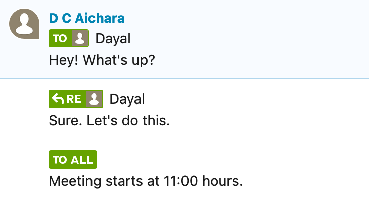
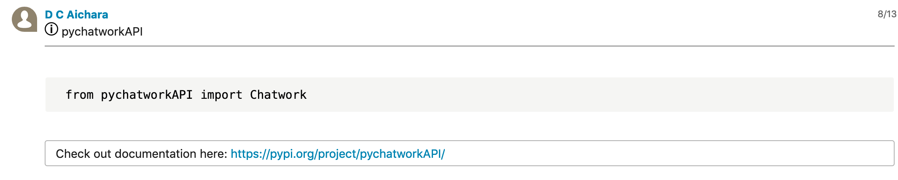

# Chatwork API V2 Wrapper


***
pychatworkAPI is a python package to access chatwork offline.  It is based on [Chatwork API V2](http://download.chatwork.com/ChatWork_API_Documentation.pdf). 

***
## Installation 

### PyPI
```
pip install pychatworkAPI
```
### From Source (Github)

git clone https://github.com/dc-aichara/pychatworkAPI.git

cd pychatworkAPI

python3 setup.py install

***

## Usages

```python
from pychatworkAPI import Chatwork

chatwork = Chatwork('Your Chatwork API Token')
```
### Basic usages
```python

>>> chatwork.get_me() # get your account information
{'account_id': xxxxx, 'room_id': 1xxxxxxx, 'name': 'Aichara', 'chatwork_id': '', 'organization_id': xxxxx, 'organization_name': 'ABC Inc.', 
'department': '', 'title': '', 'url': '', 'intron': '', 'mail': '', 'tel_organization': '', 'tel_extension': '', 'tel_mobile': '', 'skype': '', 'facebook': '', 'twitter': '', 'avatar_image_url': 'https://appdata.chatwork.com/avatar/xxxxx.rsz.jpg', 'login_mail': 'name@gmail.com'}


>>> chatwork.get_my_status() # get your status
{'unread_room_num': 0, 'mention_room_num': 0, 'mytask_room_num': 0, 'unread_num': 0, 'mention_num': 0, 'mytask_num': 0}


>>> chatwork.get_my_tasks() # get list of tasks assigned to you
[{'task_id': 139296044, 'room': {'room_id': 1xxxxx7, 'name': 'Group Name', 'icon_path': 'https://appdata.chatwork.com/icon/ico_xxx.png'},
 'assigned_by_account': {'account_id': xxxxx, 'name': 'Aichara', 'avatar_image_url': 'https://appdata.chatwork.com/avatar/xxxx/xxxx.rsz.jpg'}, 'message_id': '119629631860408724', 'body': 'Update Server', 'limit_time': 1685996399, 'status': 'open', 'limit_type': 'date'}]


>>> chatwork.get_contacts() # get contacts list


>>> chatwork.get_rooms() # get chat rooms list
(b'[{"room_id":156655687,"name":"\\u30de\\u30a4\\u30c1\\u30e3\\u30c3\\u30c8","type":"my","role":"member","sticky":true,"unread_num":0,"mention_num":0,"mytask_num":0,"message_num":4,"file_num":0,"task_num":0,"icon_path":"https://appdata.chatwork.com/avatar/ico_default_violet.png","last_update_time":1563412308}]', [{'room_id': 156655687, 'name': 'マイチャット', 'type': 'my', 'role': 'member', 'sticky': True, 'unread_num': 0, 'mention_num': 0, 'mytask_num': 0, 'message_num': 4, 'file_nu 'task_num': 0, 'icon_path': 'https://appdata.chatwork.com/avatar/ico_default_violet.png', 'last_update_time': 1563412308}])


# chatwork.send_message(self, room_id, message)
>>> chatwork.send_message(1987672538, 'test') # send message to a chat
<Response [200]>


# chatwork.send_file(self, room_id, file_path, file_name,  message)
>>> chatwork.send_file(1987672538,'a.jpg', 'test.jpg', 'test')  # send a file with message to a chat
<Response [200]>

````

### Chat Rooms

- General Room Operations 

```python

# chatwork.get_rooms_by_id(self, room_id) 
>>> chatwork.get_rooms_by_id(158013300) # get room details by room id
{'room_id': 158013300, 'name': 'pychatworkAPI', 'type': 'group', 'role': 'admin', 'sticky': False, 'unread_num': 0, 'mention_num': 0, 'mytask_num': 2, 'message_num': 5, 'file_num': 0, 'task_num': 2, 'icon_path': 'https://appdata.chatwork.com/icon/ico_idea.png', 'description': 'A chat room to test pychatworkworkAPI', 'last_update_time': 1563419004}

# chatwork.get_rooms_members(self, room_id)
>>> chatwork.get_rooms_members(15xxxx38)  # get room members information
[{'account_id': xxxxxx, 'role': 'admin', 'name': 'Aichara', 'chatwork_id': '', 
'organization_id': xxxxx, 'organization_name': 'ABC Inc.', 'department': 'Data Analytics', 
'avatar_image_url': 'https://appdatwork.com/avatar//xxxxxx.rsz.jpg'}]

# chatwork.create_new_room(self,description, members_member_ids, icon_preset, members_readonly_ids, members_admin_ids, name)
>>> chatwork.create_new_room('Test', [12, 187, 78],'group',[12, 78],[187] , 'test1') # create a new chat room
<Response [200]>

# chatwork.change_room_info(self, room_id, description, name, icon_preset)
>>> chatwork.change_room_info(158013300, 'A chat room to test pychatworkAPI', 'pychatworkAPI', 'test') # Change chat's name, description and icon 
<Response [200]>

# chatwork.change_rooms_members(self, room_id, members_admin_ids, members_member_ids, members_readonly_ids)
>>> chatwork.change_rooms_members(158013300, [4018276], [], []) # Change rooms members at once
<Response [200]>

# chatwork.delete_rooms_by_id(self, room_id, action)
>>> chatwork.delete_rooms_by_id(1xxxx96, 'leave') # leave or delete a chat room
<Response [204]>

```

- Rooms Messages


```python

# chatwork.get_rooms_messages(room_id)
>>> chatwork.get_rooms_messages(15xxxx38) # get messages of a room
[{'message_id': '11963102598912', 'account': {'account_id': xxxxx, 'name': 'Aichara', 'avatar_image_url': 'https://appdata.chatwork.com/avatar/xxx.rsz.jpg'}, 
'body': '[info][title][dtext:chatroom_groupchat_created][/title][dtext:chatroom_chatname_is]test[dtext:chatroom_set]\n\n[dtext:chatroom_member_is][piconname:367][dtext:chatroom_added][/info]', 'send_time': 1561697609, 'update_time': 0}]

>>> chatwork.get_rooms_message_information(room_id, message_id) # get specific message information from a chat room

```

- Room Tasks

```python

# chatwork.add_rooms_task(self, room_id, task_name, time_limit, account_ids)
>>> chatwork.add_rooms_task(15xxx34, 'Update Server1',1685996399,123456)  # assign a task to member of room
{'task_ids': [139298115]}

# chatwork.get_rooms_tasks(self, room_id)
>>> chatwork.get_rooms_tasks(158013300) # Get list of the tasks of a chat
[{'task_id': 141309041, 'account': {'account_id': 40276, 'name': 'Aichara', 'avatar_image_url': 'https://appdata.chatwork.com/avatar/ico_default_violet.png'}, 'assigned_by_account': {'account_id': 40276, 'name': 'D C Aichara', 'avatar_image_url': 'https://appdata.chatwork.com/avatar/ico_default_violet.png'}, 'message_id': '1203526775385116672', 'body': 'Hello', 'limit_time': 1563422400, 'status': 'open', 'limit_type': 'time'}, {'task_id': 141316537, 'account': {'account_id': 40276, 'name': 'Aichara', 'avatar_image_url': 'https://appdata.chatwork.com/avatar/ico_default_violet.png'}, 'assigned_by_account': {'account_id': 40276, 'name': 'Aichara', 'avatar_image_url': 'https://appdata.chatwork.com/avatar/ico_default_violet.png'}, 'message_id': '1203536253820076032', 'body': 'test2', 'limit_time': 1563418998, 'status': 'open', 'limit_type': 'date'}]

# chatwork.get_rooms_task_information(self, room_id, task_id)
>>> chatwork.get_rooms_task_information(1xxxxx7,139296044) # get task information by task id
{'task_id': 139296044, 'account': {'account_id': 3xxxxxx, 'name': 'Dayal Chand Aichara', 'avatar_image_url': 'https://appdata.chatwork.com/avatar/xxxx/xxxxx.rsz.jpg'}, 'assigned_by_account': {'account_id': xxxxxx, 'name': 'Dayal Chand Aichara', 'avatar_image_url': 'https://appdata.chatwork.com/avatar/xxxx/xxxx.rsz.jpg'},
 'message_id': '119629638789764', 'body': 'Update Server', 'limit_time': 1685996399, 'status': 'open', 'limit_type': 'date'}

```
- Room files

```python

# chatwork.get_rooms_files(self, room_id)
>>> chatwork.get_rooms_files(1543544441325) # get information of files in a chat room
[{'file_id': 456xx, 'message_id': '11876358888392320', 'filesize': 91571, 'filename': 'abc.png', 'upload_time': 1559627849, 
'account': {'account_id': xxxx, 'name': 'Dayal Chand Aichara', 'avatar_image_url': 'https://appdata.chatwork.com/avatar/xxxx.rsz.jpg'}}, {'file_id': 37xxxx, 'message_id': '118763998741469696', 'filesize': 202409, 'filename': '2019-06-03.png', 'upload_time': 1559629010, 'account':
 {'account_id': xxxx, 'name': 'Dayal Chand Aichara', 'avatar_image_url': 'https://appdata.chatwork.com/avatar/xxxx.rsz.jpg'}}]

# chatwork.get_rooms_file_information(self, room_id, file_id)
>>> chatwork.get_rooms_file_information(1543544441325,3851450 ) # get details of a file by file id in a chat room
{'file_id': 3851450, 'message_id': '1193811580355072', 'filesize': 177560, 'filename': 'data.png', 'upload_time': 1561100416, 'account':
 {'account_id': xxxx, 'name': 'Dayal Chand Aichara', 'avatar_image_url': 'https://appdata.chatwork.com/avatar/xxxx.rsz.jpg'}, 
 'download_url': 'https://appdata.chatwork.com/uploadfile/xxxx/xxxxxx/1633a41e6e6f5f0ff95d7299ff5beabf.dat?response-content-type=&response-content-disposition=attachment%3Bfilename%2A%3DUTF-8%27%27price.png&Expires=1561699134&Signature=YzyVHZaO-ZKZDjCQTYpI7JhPd8OSMZaPIMhof25aTZOdCXI-AtkJiXP1KjfcWzAnx1A-hqy08NgdfoCjjpJJlu-IWtuAn3dbrEdbklPR-udQO4i9kFiy-fTF2yUcchbuwg7mpxrYlcobTA4FZ-ojt74gv8up3HOcqJw3EcVh1RTH8rpqYqQXxklpM0-G4aPlyJ3mNqvWOvZhB4ym0daiXXqw8lmm~cAw-ai~BQ7TRgxXj~E5kWuhxJpEiBT61odILnlwSNMVODRnr76UCjljl2OEaFnpPl5fKW3J2lo9Hmq15aK-wf7OfnfIrs~5zKCbfTmetlTL-fOy-kHacC6dCg__&Key-Pair-Id=XXXXXXXXXX'}


```
### Handling incoming requests

```python

>>> chatwork.get_incoming_requests() # get incoming requests to join chat rooms


>>> chatwork.approve_incoming_requests(self, request_id) # approve incoming request by request id
 

>>> chatwork.delete_incoming_requests(self, request_id) # delete incoming request by request it


```

***
## How to reply or send message to specific person or all group members? 

```python
# Reply to specific person in group 
# chatwork.send_message(room_id, "[Reply aid=person's id] person'name \n" + "message")
>>> chatwork.send_message(1598363, "[Reply aid=4018276] Dayal \n" + "Sure. Let's do this. ")
<Response [200]>

# Send message to specific person 
# chatwork.send_message(room_id, '[to:person's id] person's name \n' + 'message')
>>> chatwork.send_message(1598363, '[To:4018276] Dayal \n' + "Hey! What's up ?" )
<Response [200]>

# Send message to all members of a chat
# chatwork.send_message(room_id, "[toall]\n" + "message")

>>> chatwork.send_message(1598363, "[toall]\n" + "Meeting starts at 11:00 hours.")
<Response [200]>

# Note: If you don't know recipient's id, then you can just use [To] name and [Reply aid=0] name .

```



***

## Message Decoration in Chatwork

```python
# Heading  ---> [title] message [/title]

# Horizontal line ---> [hr]

>>> chatwork.send_message(15983632, "[title] pychatworkAPI [/title][hr]")
<Response [200]>

# Code Style  ---> [code] message [/code]

>>> chatwork.send_message(15983632, "[code] from pychatworkAPI import Chatwork [/code]")
<Response [200]>

# Box style ---> [info] message [/info]

>>> chatwork.send_message(15983632, "[info] Check out documentation here: https://pypi.org/project/pychatworkAPI/ [/info]")
<Response [200]>

```


***


## *Responses*

> <Response [200]> Successful

> <Response [204]> No content 

> <Response [400] > Bad Request

> <Response [401]> Unauthorized

> <Response [403]> Unsuccessful (Check your inputs)

> <Response [429] > Too many requests (Request limit is 300/5 minutes)

***
## License 
[MIT](https://choosealicense.com/licenses/mit/) © [Dayal Chand Aichara](https://github.com/dc-aichara)

***

###  Note: 

1. Read [Chatwork API V2](http://download.chatwork.com/ChatWork_API_Documentation.pdf) documentation to learn more. <br>
2. Ask your queries in [pychatworkAPI Chatwork](https://www.chatwork.com/g/05qdcee7td8lkt) group. 


Check out [Webpage of pychatworkAPI](https://dc-aichara.github.io/pychatworkAPI/). 